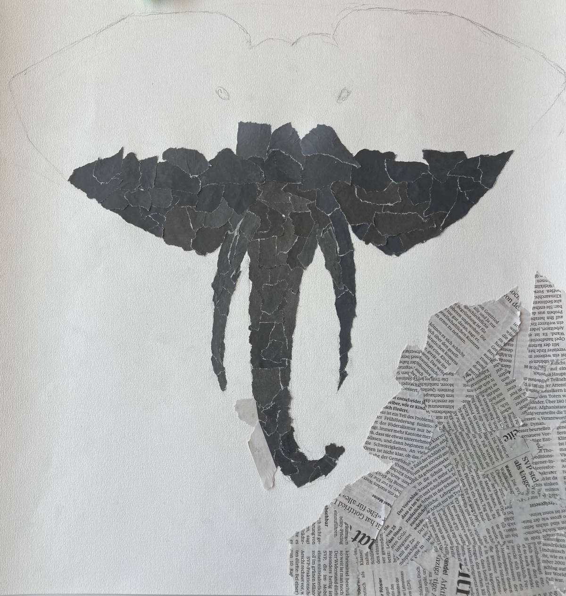
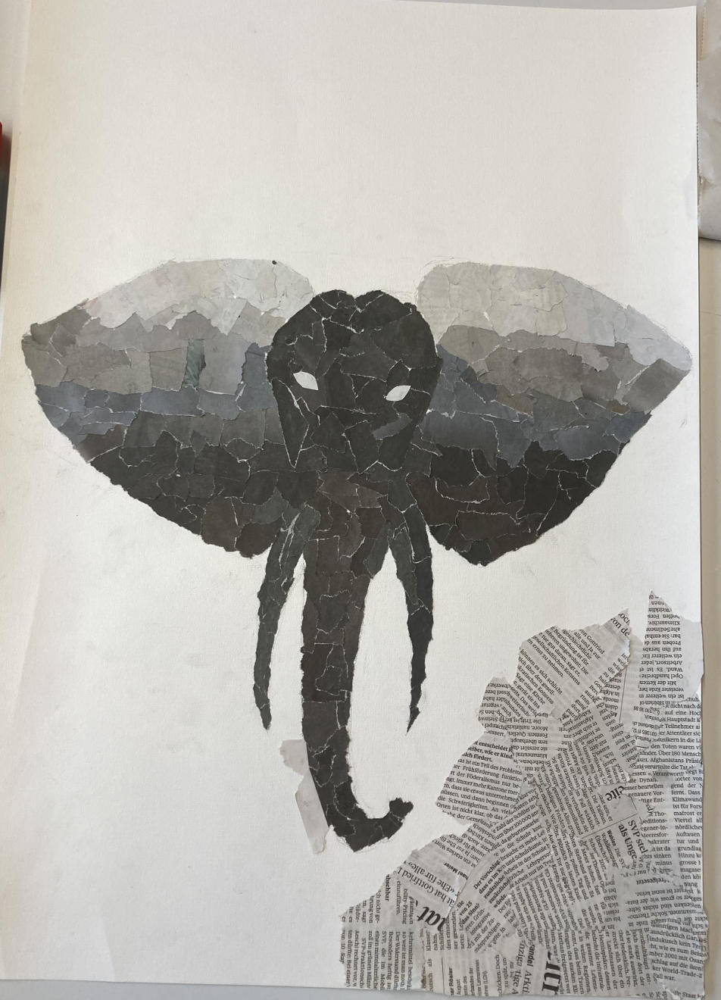
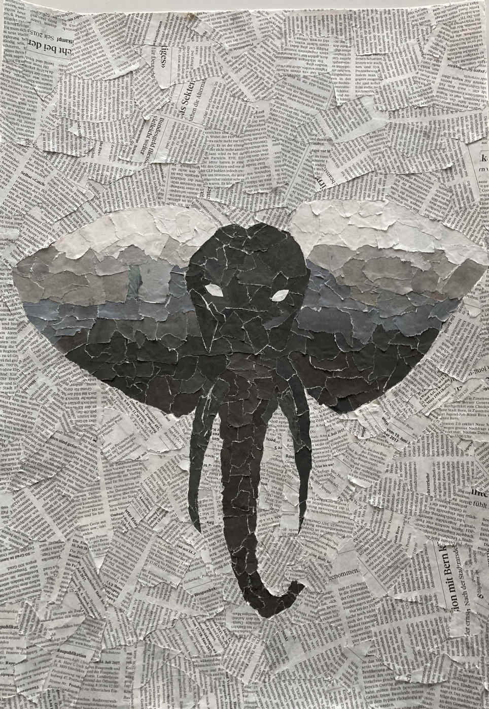

+++
title = "Collage vom Elefant"
date = "2022-05-10"
draft = false
pinned = false
image = "img_2958.jpg"
+++
# Idee

Im BG Unterricht erhielten wir die Aufgabe, eine persönliche Arbeit zu erstellen. Nach kurzem Überlegen entschloss ich mich dazu, eine Collage mit Zeitungspapier zu erstellen. Mit der Internetrecherche bin ich dann auch auf das passende Motiv mit dem Elefantenkopf gekommen. 

# Umsetzung

Als Grundlage habe ich ein weisses A3 Blatt gewählt, wo ich zuerst mit Bleistift den Elefantenkopf skizziert habe. Als nächstes musste ich mich für einen Klebstoff entscheiden. Kleister war mein erster Gedanke, jedoch wurde das Zeitungspapier bei den ersten Probeversuchen labbrig und es zerfiel fast. Daraufhin entschied ich mit dazu, eine klassischen Leimstift zu verwenden. Ich begann damit das innere des Elefantenkopfes mit Zeitungsschnipsel zu füllen. Um das ganze noch spannender zu gestalten, habe ich noch einen Farbverlauf eingebaut. Den Hintergrund habe ich mit Textschnipsel gefüllt, sodass der Kopf richtig gut zur Geltung kommt. 

# Fazit

Die fertige Arbeit soll jetzt noch eingerahmt werden, damit sich keine Schnipsel lösen. Ich hatte eigentlich keine Schwierigkeiten beim erstellen der Collage. Nur der Arbeitsschritt vom Ausfüllen des Hintergrunds war ein wenig monoton und einseitig.  Das ganze Projekt der persönlichen Arbeit hat aber mir sehr gefallen und ich finde diese eine interessante BG-Arbeit. Auch mit meinem Endprodukt bin ich zufrieden. Vielleicht schafft es ja die Collage in mein Zimmer oder an die Wohnzimmerwand. 

